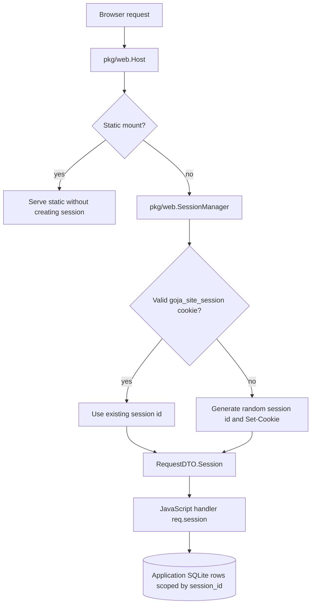

# Session Cookie Implementation Guide

## Executive summary

`goja-site` now has Go-side support for lightweight browser sessions. The server issues an opaque cookie named `goja_site_session`, exposes it to JavaScript as `req.session`, and lets higher-level modules such as `kanban.dsl` carry that same session into render contexts and action callbacks. The implementation is deliberately small: it is an identity cookie, not a login system, not a server-side session store, and not an authorization layer.

The purpose is to give application scripts a stable per-browser key that can be used at the database boundary. A JavaScript app should not have to parse cookies or generate secure random IDs. It should receive `req.session.id`, use it in SQL where needed, and otherwise ignore it. The Kanban example demonstrates this shape by storing `session_id` on each card. Two browsers can use the same SQLite database while seeing separate demo boards.

The core rule is:

```text
Go owns cookie mechanics.
JavaScript owns what the session ID means in the data model.
```

That rule is what keeps the feature useful without making it too large. The Go host creates and validates the session identity. The app decides whether to use it for cards, tasks, preferences, temporary state, or nothing at all.

## Problem statement

Before sessions, every browser using the Kanban example shared the same rows in SQLite. That was acceptable for a single-user demo, but it is wrong for a website host that can serve multiple browsers or tabs. If two people open the board, they should not necessarily see and move the same cards. If one browser creates a card, another browser should not see that card unless the app intentionally models shared data.

The simplest way to separate user data is to add a session key to rows:

```sql
session_id TEXT NOT NULL
```

and then query with:

```sql
WHERE session_id = ?
```

But that raises another question: where does the session ID come from? Application JavaScript could parse cookies, generate random IDs, and set `Set-Cookie` headers manually, but that is exactly the kind of repetitive infrastructure the Go host should own. It is easy to get cookie attributes wrong. It is also not app-specific business logic.

The desired application experience is this:

```javascript
app.get("/api/cards", (req, res) => {
  res.json(listCards(req.session, req.query));
});
```

and for mounted Kanban boards:

```javascript
.data(data => data
  .cards(ctx => listCards(ctx.session, ctx.query || {}))
)
.actions(actions => actions
  .cardMoved(event => {
    moveCard({ session: event.session, id: event.cardId, ... });
    return { ok: true, refresh: true };
  })
)
```

That is the target: the session is visible exactly where the app needs to scope database access.

## Current implementation

The implementation consists of four pieces:

1. `pkg/web/session.go` implements session ID generation, cookie issuance, cookie validation, and the JavaScript-facing session DTO.
2. `pkg/web/host.go` asks the session manager for a session before dispatching dynamic routes.
3. `pkg/web/request_response.go` includes the session in the request DTO exposed to JavaScript.
4. `pkg/kanbanddsl/mount.go` propagates `req.session` into Kanban render contexts and action events.

The data flow looks like this:



Static routes are checked before sessions. This is intentional: fetching `/assets/trail-map.png` should not create a new session for a browser that has not loaded an application page. Dynamic routes create sessions because they represent app interaction.

## The session manager

`pkg/web/session.go` defines the session options, DTO, manager, and ID helpers.

The defaults are:

```go
const defaultSessionCookieName = "goja_site_session"
```

```go
type SessionOptions struct {
    Disabled   bool
    CookieName string
    Path       string
    MaxAge     time.Duration
    Secure     bool
    SameSite   http.SameSite
}
```

When no options are provided:

- cookie name is `goja_site_session`,
- path is `/`,
- max age is one year,
- same-site mode is `Lax`,
- `HttpOnly` is always set when the cookie is issued,
- `Secure` is configurable and currently defaults to false for local development.

The session DTO is intentionally small:

```go
type SessionDTO struct {
    ID         string
    IsNew      bool
    CookieName string
}
```

and maps to JavaScript as:

```javascript
req.session = {
  id: "9h24ZY8h3xKOms--VzQHXwlUBnSIBhOAEQiWRchd9p4",
  isNew: true,
  cookieName: "goja_site_session"
}
```

The ID is generated from 32 cryptographically random bytes:

```go
func newSessionID() (string, error) {
    buf := make([]byte, 32)
    if _, err := rand.Read(buf); err != nil {
        return "", fmt.Errorf("generate session id: %w", err)
    }
    return base64.RawURLEncoding.EncodeToString(buf), nil
}
```

Base64url without padding gives a compact string that is safe in cookies and SQL text fields.

The validation rule is deliberately narrow:

```go
var sessionIDPattern = regexp.MustCompile(`^[A-Za-z0-9_-]{22,128}$`)
```

If a cookie is missing or invalid, the host generates a new session rather than trusting arbitrary input.

## Host integration

The host owns session attachment because it already owns request parsing and response creation. In `pkg/web/host.go`, dynamic route dispatch now begins like this:

```go
session, err := h.sessions.Session(w, r)
if err != nil {
    http.Error(w, err.Error(), http.StatusInternalServerError)
    return
}
req, err := NewRequestDTO(r, params, session)
```

This order is important. The session manager may write a `Set-Cookie` header. It must do that before the response body is sent. It also needs access to the raw `http.Request` so it can inspect cookies.

The host constructor wires the manager:

```go
func NewHost(opts HostOptions) *Host {
    return &Host{
        registry: NewRegistry(),
        dev: opts.Dev,
        renderer: opts.Renderer,
        sessions: NewSessionManager(opts.Sessions),
    }
}
```

The `HostOptions.Sessions` field makes the behavior configurable later without changing call sites. Today the server uses the defaults.

## Request DTO integration

`pkg/web/request_response.go` adds `Session *SessionDTO` to `RequestDTO` and includes it in the map exposed to JavaScript:

```go
func (r *RequestDTO) Map() map[string]any {
    return map[string]any{
        "method":  r.Method,
        "url":     r.URL,
        "path":    r.Path,
        "query":   r.Query,
        "params":  r.Params,
        "headers": r.Headers,
        "cookies": r.Cookies,
        "session": r.Session.Map(),
        "ip":      r.IP,
        "body":    r.Body,
        "rawBody": r.RawBody,
    }
}
```

The existing `cookies` object remains available. The new `session` object is the preferred identity mechanism. Apps should not generally inspect `req.cookies.goja_site_session`; they should use `req.session.id`.

## JavaScript API contract

A normal route handler sees:

```javascript
app.get("/whoami", (req, res) => {
  res.json({ sessionId: req.session.id, isNew: req.session.isNew });
});
```

The session object is available for every dynamic route, including JSON APIs and form posts. For example, the session-scoped Kanban API is:

```javascript
app.get("/api/cards", (req, res) => {
  res.json(listCards(req.session, req.query));
});
```

The helper in the example accepts either a session object or a string:

```javascript
function sessionId(session) {
  if (typeof session === "string") return session;
  return String(session?.id || "default");
}
```

This makes internal app code slightly easier to reuse. A caller can pass the full `req.session`, the full `event.session`, or a known session ID string.

## Kanban DSL propagation

Mounted Kanban routes are not ordinary app routes written directly in `app.js`; they are registered by `board.mount(app, "/_kanban")`. That means `kanban.dsl` has to propagate session explicitly.

Fragment rendering now passes session into the board context:

```go
node, err := b.Render(b.vm.ToValue(map[string]any{
    "query": reqObj.Get("query").Export(),
    "session": reqObj.Get("session").Export(),
}))
```

Action dispatch injects session into the event before calling the registered callback:

```go
body := reqObj.Get("body")
if missingValue(body) {
    body = b.vm.ToValue(map[string]any{})
}
bodyObj := body.ToObject(b.vm)
_ = bodyObj.Set("session", reqObj.Get("session"))
result, err := b.Dispatch(action, bodyObj)
```

Action-triggered refresh also passes the session back into rendering:

```go
node, err := b.Render(b.vm.ToValue(map[string]any{
    "query": reqObj.Get("query").Export(),
    "session": reqObj.Get("session").Export(),
}))
```

This gives app authors the same session object in three places:

| Place | Object | Typical use |
|---|---|---|
| Normal route | `req.session.id` | Create rows, API queries, page render calls. |
| Kanban render hook | `ctx.session.id` | Load cards for this browser/session. |
| Kanban action callback | `event.session.id` | Move, create, update, or delete cards for this session. |

That symmetry is the main ergonomic goal.

## Session-scoped Kanban data

The Kanban example now stores `session_id` on every card:

```sql
CREATE TABLE IF NOT EXISTS cards (
  id INTEGER PRIMARY KEY AUTOINCREMENT,
  session_id TEXT NOT NULL DEFAULT 'default',
  title TEXT NOT NULL,
  description TEXT,
  status TEXT NOT NULL DEFAULT 'todo',
  position INTEGER NOT NULL DEFAULT 0,
  ...
)
```

Existing databases are migrated with:

```javascript
ignoreDuplicateColumn(() => db.exec(
  "ALTER TABLE cards ADD COLUMN session_id TEXT NOT NULL DEFAULT 'default'"
));
```

The app seeds demo cards per session:

```javascript
function seedIfEmpty(session) {
  const sid = sessionId(session);
  const rows = db.query("SELECT COUNT(*) AS count FROM cards WHERE session_id = ?", sid);
  if (rows.length && Number(rows[0].count || 0) === 0) {
    cards.forEach(c => db.exec(
      "INSERT INTO cards(session_id, title, description, status, position, tag, due_date, done, image) VALUES (?, ?, ?, ?, ?, ?, ?, ?, ?)",
      sid,
      ...c
    ));
  }
}
```

Queries are scoped:

```javascript
function listCards(session, filters) {
  const sid = sessionId(session);
  seedIfEmpty(sid);
  filters = normalizeFilters(filters);
  const where = ["session_id = ?"];
  const args = [sid];
  ...
  return db.query(sql, ...args);
}
```

Movement is scoped:

```javascript
function moveCard({ session, id, toStatus, toIndex }) {
  const sid = sessionId(session);
  const existing = db.query(
    "SELECT * FROM cards WHERE session_id = ? AND id = ?",
    sid,
    id
  )[0];
  ...
}
```

The app still sees the session where it matters: at database reads and writes. It does not see cookie parsing, validation, cookie attributes, or header writing.

## Validation evidence

The session manager has a direct integration test in `pkg/web/session_test.go`. It registers a JavaScript route:

```javascript
app.get("/session", (req, res) => res.json({
  id: req.session.id,
  isNew: req.session.isNew
}));
```

The test verifies that:

1. the first request returns a valid session ID,
2. the first response sets a `goja_site_session` cookie,
3. `isNew` is true for the first request,
4. sending the cookie on a second request reuses the same ID,
5. `isNew` is false for the second request,
6. the second response does not unnecessarily replace the cookie.

`pkg/kanbanddsl/mount_test.go` verifies that mounted Kanban action callbacks receive `event.session.id` by returning it from the callback and checking that it appears in the JSON response.

The live smoke test used two independent curl cookie jars:

```bash
curl -c a.cookies http://127.0.0.1:60129/
curl -c b.cookies http://127.0.0.1:60129/

curl -b a.cookies -X POST http://127.0.0.1:60129/cards \
  -H 'Content-Type: application/x-www-form-urlencoded' \
  --data 'title=Session+A+Only&description=private&status=todo&tag=Private'

curl -b a.cookies http://127.0.0.1:60129/api/cards
curl -b b.cookies http://127.0.0.1:60129/api/cards
```

Observed evidence:

```text
A_COUNT=10
B_COUNT=10
A_HAS=1
B_HAS=0
```

This proves the desired behavior: both sessions get their own seeded board; a new card created in session A does not appear in session B.

## Design decisions

### Decision: store only an opaque ID in the cookie

The cookie contains only a random session ID. It does not contain serialized app data. This keeps the cookie small and avoids signing/encryption questions for now. Application state belongs in SQLite.

### Decision: expose `req.session`, not only `req.cookies`

Apps can still inspect cookies, but `req.session` is the stable API. It communicates intent: this is the server-issued identity for scoping state.

### Decision: do not create sessions for static files

Static files are served before dynamic dispatch. This avoids session cookies being issued just because a browser fetched an image or script directly.

### Decision: make session storage app-owned

The host does not create a `sessions` SQL table. That keeps the session layer generic. Apps that need last-seen timestamps, quotas, or cleanup policies can create their own session metadata table.

This matters for the second design document in this ticket: database cleanup policy should be app-specific. Some apps may clean old Kanban cards. Others may clean generated files, chat transcripts, or import jobs. The host should provide identity and measurement, not impose a schema.

## Alternatives considered

### Manual cookies in JavaScript

The app could use `req.cookies`, generate an ID, and call `res.set("Set-Cookie", ...)`. This was rejected because every app would repeat security-sensitive details.

### Full server-side session store

The host could maintain an in-memory or SQLite-backed session store. That is too much for the current goal. It would raise questions about expiration, persistence, cleanup, cross-process behavior, and authentication semantics.

### Signed cookie with structured session data

Signed structured cookies are useful for auth-lite systems, but they are unnecessary here. The app already has SQLite. A random opaque ID is enough to look up state.

### Session table managed by Go

The Go host could write a `goja_sessions` table automatically. That might help cleanup policies later, but it couples the generic host to the application database schema. For now, app-owned metadata is cleaner.

## Implementation plan for future hardening

The current implementation is complete for opaque session identity. If this evolves further, the next steps should be:

1. Add `SessionOptions` to `app.Config` / CLI flags if operators need custom cookie names, secure cookies, or shorter max age.
2. Add a small `session.dsl` or `session` module only if apps repeatedly need helper methods such as `touch`, `clear`, or `rotate`.
3. Add explicit cookie clearing / session rotation APIs if login/logout semantics appear.
4. Add CSRF guidance if mutating form endpoints become exposed beyond local/internal trusted use.
5. Add an app-level `sessions` table pattern for cleanup policies, but keep it opt-in.

## Open questions

- Should `--dev` default session cookies to non-secure while production modes default to `Secure` when TLS is expected?
- Should the session cookie name be configurable from the CLI?
- Should the host expose `req.session.isNew` to app code permanently, or is it mostly a debugging convenience?
- Should the app provide a standard `sessions` table in examples so cleanup callbacks can reason about old sessions more easily?

## Summary

The session implementation intentionally does one job: give each browser a stable, opaque, Go-generated session ID and expose it to server-side JavaScript. That is enough to let apps scope database rows by user/session while avoiding repeated cookie plumbing. The Kanban example now demonstrates the intended pattern: the app uses `session_id` where it queries and mutates rows, and the rest of the system carries the session automatically.
