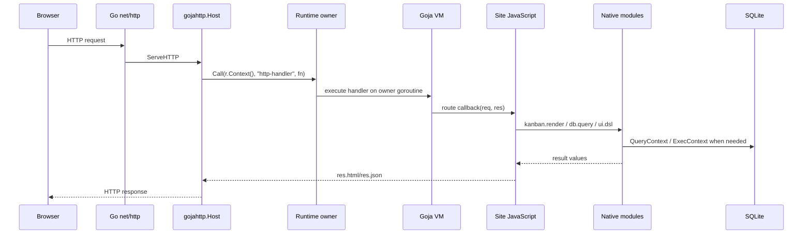

# Holistic goja-site performance architecture guide

This guide looks beyond one function-level optimization. The pprof data identifies `preciseMoveForm`, UI DSL rendering, allocation, GC, and large response writing as immediate bottlenecks. Those are concrete implementation targets. The broader question is how `goja-site` should host JavaScript applications efficiently when the application logic runs inside Goja sandboxes and the UI can be described through a display protocol.

The central design choice is where work should happen. A hosted site can do all rendering on the server and return full HTML. It can return partial HTML. It can return structured patches. It can ask the browser to own more interaction state. It can precompile route and render functions. It can run multiple VMs. Each choice changes performance, isolation, implementation complexity, and the programming model exposed to site authors.

## Implementation update: simplification first

The first implemented optimization follows the opinionated path described later in this guide: reduce repeated server work before adding more parallel execution. The implementation removed eager per-card precise movement forms from the server-rendered DSL and moved the accessible movement surface into the frontend runtime. This preserves a compact DSL and reduces server-rendered markup while still giving keyboard users a card action menu.

The post-simplification benchmark shows why this direction is important. The multi-VM `kanban-fragment` 4VM/400s cell improved from multi-second p95 latency and throughput shortfall to 399.76/s throughput with p95 7.76 ms.

## 1. Current architecture in one request

The current single-site path is:



`serve-multi` repeats this structure once per configured site and dispatches by Host header:

```text
one process
one public listener
one MultiServer
N configured sites
N Server objects
N Goja runtimes/VMs
N runtime owner loops
```

The current rendering path is server-heavy. The Kanban fragment endpoint renders board HTML on every request. The Kanban action endpoint often dispatches an action, renders the board again, converts the UI DSL node tree to HTML, and returns that HTML inside JSON.

## 2. Fundamental performance dimensions

Before choosing an optimization, separate the dimensions being optimized.

| Dimension | What it means | Current pressure point |
|---|---|---|
| Request service time | CPU time needed to handle one request. | UI DSL rendering and `preciseMoveForm`. |
| Queueing | Requests waiting for owner-loop or CPU availability. | Single VM serializes JS execution; multi-VM shifts pressure to CPU/GC. |
| Response size | Bytes returned to the browser. | Kanban fragment is about 246 KB per request. |
| Allocation rate | New Go objects per request. | UI DSL nodes, attrs maps, strings, buffers. |
| GC cost | CPU spent tracing and collecting allocations. | pprof shows `runtime.gcDrain` and `runtime.mallocgc`. |
| Browser work | DOM parsing, replacement, event handlers. | Full root replacement after action responses. |
| Site author complexity | How much the JS author must understand. | Full server render is simple; patches/client code are more complex. |
| Isolation | How safely one site is separated from another. | Goja VM per site gives clear isolation. |

A useful optimization reduces one or more of these dimensions without making the programming model too difficult for the intended site authors.

## 3. Optimization levels

There are several levels of optimization. They should not be treated as mutually exclusive.

### Level 1: Reduce generated markup

This is the smallest change. It keeps the current server-rendered HTML model but generates less HTML.

Examples:

- disable or lazy-render `preciseMoveForm`,
- remove redundant attributes,
- reduce wrapper elements,
- avoid rendering controls that are not visible by default,
- compact large repeated structures.

This level is low risk because route semantics and response types remain unchanged.

### Level 2: Cache stable render fragments

Many parts of a board are stable across requests. Column titles, column IDs, static option lists, and repeated controls can be cached.

Examples:

- cache destination-column `<option>` nodes or HTML,
- cache column headers,
- cache card body HTML when card data did not change,
- cache board shell markup.

Caching helps when repeated render work is deterministic and invalidation is simple. It hurts when invalidation becomes complex or when cached data accidentally captures request-specific state.

### Level 3: Return partial HTML

Instead of returning the whole board after an action, return only the changed card or changed columns.

Examples:

```json
{
  "ok": true,
  "patches": [
    { "op": "replaceHTML", "selector": "[data-kb-column-id='todo']", "html": "..." },
    { "op": "replaceHTML", "selector": "[data-kb-column-id='done']", "html": "..." }
  ]
}
```

This reduces server render work and response size when the changed area is much smaller than the board. It requires the client runtime to apply patches safely.

### Level 4: Return structured state deltas

Instead of returning HTML, return semantic changes:

```json
{
  "ok": true,
  "changes": [
    {
      "type": "cardMoved",
      "cardId": "1",
      "from": { "columnId": "todo", "index": 0 },
      "to": { "columnId": "done", "index": 0 }
    }
  ]
}
```

The browser updates the DOM. This shifts work from server render to client-side DOM operations. It can greatly reduce response size. It also asks the client runtime to preserve correctness across edge cases.

### Level 5: Client-side site code

The site author writes or supplies browser-side JavaScript for interaction and rendering. The Goja-hosted server still owns data, permissions, and trusted actions, but the browser owns more UI behavior.

This can be the highest-performance approach for interactive applications. It is also the largest change to the programming model.

## 4. Display protocol options

The current display protocol is effectively server-rendered UI DSL converted to HTML. A more explicit protocol can make performance work systematic.

### Option A: HTML response protocol

The server returns HTML strings.

```json
{ "ok": true, "html": "<section ...>...</section>" }
```

Pros:

- simple mental model for site authors,
- works with server-rendered UI DSL,
- browser runtime only needs to replace DOM,
- easy to debug by inspecting HTML.

Cons:

- large responses for large components,
- repeated HTML parsing in the browser,
- server pays full render cost,
- difficult to preserve client-local UI state across replacement,
- pprof shows allocation and rendering pressure.

### Option B: HTML patch protocol

The server returns targeted HTML patches.

```json
{
  "ok": true,
  "patches": [
    { "op": "replace", "target": "[data-kb-card-id='1']", "html": "<article ...>...</article>" },
    { "op": "setText", "target": "[data-kb-count='done']", "text": "41" }
  ]
}
```

Pros:

- keeps server-side rendering for changed pieces,
- reduces response size,
- client runtime is generic,
- site authors can still mostly think in UI DSL.

Cons:

- needs stable selectors,
- patch ordering matters,
- invalid selectors must be handled,
- partial rendering APIs must be added,
- testing must cover DOM update correctness.

### Option C: Semantic event protocol

The server returns domain events or state changes.

```json
{
  "ok": true,
  "events": [
    { "type": "cardMoved", "cardId": "1", "toColumnId": "done", "toIndex": 0 }
  ]
}
```

Pros:

- small responses,
- less server rendering,
- browser can update efficiently,
- aligns with interactive UI behavior.

Cons:

- client runtime must understand domain semantics,
- site authors need predictable client behavior,
- server and client state can diverge if events are applied incorrectly,
- accessibility and no-JavaScript behavior need a separate strategy.

### Option D: Client component protocol

The site provides client components or client-side render functions. The server returns data, not HTML.

Pros:

- best fit for highly interactive sites,
- server avoids most UI render work,
- client can preserve local UI state naturally,
- response payloads can be small.

Cons:

- requires bundling or serving client code,
- expands the trusted/untrusted boundary discussion,
- requires a browser-side module API,
- increases authoring complexity,
- introduces compatibility and versioning concerns.

## 5. Recommended architectural direction

The safest path is incremental:

1. Keep full server-rendered HTML as the compatibility baseline.
2. Add lighter render modes for expensive built-in controls.
3. Add a generic patch response protocol.
4. Add optional semantic responses for Kanban actions.
5. Later, add an explicit client-code API for sites that need richer performance.

This sequence lets existing sites keep working. It also lets performance-sensitive sites opt into more client-side behavior without forcing every site author to adopt a heavier model.

## 6. Concrete API proposal: action response modes

Today a Kanban action returns an object. If `refresh` is true or absent, the mounted action route renders full board HTML and includes it as `html`.

Current behavior:

```javascript
return { ok: true, refresh: true, moved: card.id, status: card.status };
```

Proposed extension:

```javascript
return {
  ok: true,
  refresh: {
    mode: "full"
  }
};

return {
  ok: true,
  refresh: {
    mode: "columns",
    columnIds: ["todo", "done"]
  }
};

return {
  ok: true,
  refresh: {
    mode: "none"
  },
  events: [
    { type: "cardMoved", cardId: "1", toColumnId: "done", toIndex: 0 }
  ]
};
```

Server pseudocode:

```go
refresh := parseRefreshMode(out["refresh"])
switch refresh.Mode {
case "full":
    out["html"] = renderWholeBoard()
case "columns":
    out["patches"] = renderColumnPatches(refresh.ColumnIDs)
case "none":
    // Return action data only.
case "events":
    out["events"] = normalizeEvents(out["events"])
default:
    return error("invalid refresh mode")
}
```

Client pseudocode:

```javascript
async function postAction(board, action, event) {
  const payload = await postJSON(...);
  if (payload.html) replaceRoot(payload.html);
  if (payload.patches) applyPatches(payload.patches);
  if (payload.events) applyKanbanEvents(board, payload.events);
  return payload;
}
```

This allows one action mechanism to support full compatibility, partial render, and semantic update modes.

## 7. Concrete API proposal: site client modules

A more holistic design gives a hosted site two script environments:

```text
server scripts: run inside Goja, trusted, access native modules and DB
client scripts: served to browser, untrusted with respect to server data, use HTTP APIs
```

Possible site layout:

```text
scripts/server/app.js
scripts/client/kanban-client.js
```

Server-side API:

```javascript
const app = express.app();
const assets = require("assets");

assets.clientScript("/assets/kanban-client.js", "scripts/client/kanban-client.js");

app.get("/", (req, res) => {
  res.html(ui.page(
    ui.script({ src: "/assets/kanban-client.js", defer: true }),
    board.render({ mode: "initial" })
  ));
});
```

Client-side API:

```javascript
import { postAction, applyKanbanEvents } from "/_goja/client-api.js";

document.addEventListener("drop", async event => {
  const response = await postAction("bench", "cardMoved", eventToPayload(event));
  applyKanbanEvents(document, response.events);
});
```

Pros:

- gives high-performance sites a path to client-side interaction,
- keeps server-side Goja for trusted data and actions,
- avoids making every server action return full HTML,
- lets the default server-rendered mode remain simple.

Cons:

- requires asset serving and cache invalidation,
- requires a stable browser API,
- requires documentation for site authors,
- requires tests for browser-side behavior,
- complicates the security model because site code now runs in two environments.

## 8. VM architecture considerations

Multi-VM testing showed that multiple Goja VMs can execute in parallel under `serve-multi`. The CPU profile for four VMs at 400/s had about four cores of samples. That means a VM-per-site model can use CPU parallelism.

However, multi-VM does not remove per-request render cost. If every VM renders the same large board response, total process throughput eventually hits CPU, allocation, GC, and response-writing limits.

A transparent VM pool for one logical site would require additional decisions:

| Question | Why it matters |
|---|---|
| Do VMs share one database? | Shared DB can serialize writes and create lock contention. |
| Do sessions need VM affinity? | JS globals and in-memory state may differ between VMs. |
| Are route registrations identical? | Every VM must load the same scripts and expose the same routes. |
| How are reloads coordinated? | A site update must replace or refresh every VM consistently. |
| How are metrics labeled? | Per-VM labels can create high cardinality if not bounded. |
| What happens to in-flight requests during reload? | Requests must finish or be cancelled safely. |

A VM pool should not be the first optimization. The current evidence says render work dominates. A pool can increase parallelism, but it can also multiply memory use and GC pressure. It should be considered after per-request render cost is reduced.

## 9. Caching strategy

Caching should be introduced only where invalidation is simple.

Good cache candidates:

- static column option lists,
- column header HTML when column config is static,
- board shell HTML when it does not depend on request context,
- rendered card body keyed by card ID and card version,
- client script contents.

Bad cache candidates:

- rendered whole board HTML if cards change frequently,
- request-specific markup that includes session or query state,
- search-filtered output,
- anything depending on arbitrary JavaScript callbacks without a version key.

A useful cache API should be explicit:

```javascript
.render(render => render
  .card(card => ...)
  .cardCacheKey(card => card.id + ":" + card.updatedAt))
```

Go pseudocode:

```go
func (b *Board) renderCard(ctx goja.Value, card renderedCard, index, columnCount int) uidsl.Node {
    key, ok := b.cardCacheKey(card)
    if ok {
        if cached := b.cache.Get(key); cached != nil {
            return cloneWithPositionAttrs(cached, index, card.ColumnID)
        }
    }

    node := b.renderCardUncached(ctx, card, index, columnCount)
    if ok { b.cache.Set(key, stripPositionAttrs(node)) }
    return node
}
```

Caching UI DSL nodes directly can be dangerous if nodes are mutated. Caching rendered HTML fragments may be safer. The tradeoff is that HTML fragments are less composable than nodes.

## 10. Testing strategy for architectural changes

Every architectural optimization needs three layers of tests.

### Correctness tests

Verify that user-visible behavior is unchanged:

- board renders expected cards,
- drag/drop still posts `cardMoved`,
- action response updates the visible board,
- search counts remain correct,
- read-only boards do not expose mutating controls,
- invalid action payloads return errors.

### Protocol tests

If a patch or event protocol is introduced, test protocol handling directly:

```text
full refresh response replaces root
patch response replaces target node
event response moves card in DOM
invalid patch target is reported
unknown event type is ignored or errors according to spec
```

### Performance tests

Performance tests should compare before and after:

```text
same card count
same columns
same action payload
same rates
same VM count
same measurement duration
```

Record:

- throughput ratio,
- p50/p95/p99/max,
- response bytes,
- rendered HTML bytes metric,
- CPU pprof top,
- heap/allocs pprof top,
- Go heap and goroutine metrics.

## 11. Recommended implementation sequence

### Phase 1: preciseMove render modes

Implement `preciseMove("none")` and keep eager as default. Validate with before/after benchmarks.

### Phase 2: lazy preciseMove trigger

Add `preciseMove("button")` and client-side trigger behavior. Validate accessibility and keyboard behavior before recommending it as a default.

### Phase 3: action refresh modes

Add `refresh: { mode: "none" }` and `refresh: { mode: "full" }` as explicit alternatives. Then add `columns` or `patches`.

### Phase 4: patch protocol

Add generic client runtime support for patch operations. Keep the protocol small:

```text
replaceHTML
appendHTML
remove
setText
setAttr
```

Do not add a large browser framework inside the runtime. Keep the protocol auditable.

### Phase 5: optional client modules

Add a documented way for sites to serve client-side JavaScript and use a stable browser API. This is a larger architecture change and should be designed after the server-render and patch phases have data.

## 12. Decision matrix

| Approach | Performance potential | Compatibility risk | Implementation cost | Recommended timing |
|---|---:|---:|---:|---|
| Disable eager precise forms | High for current hotspot | Low if opt-in | Low | First. |
| Lazy precise forms | High | Medium | Medium | After `none`. |
| Cache static form options | Medium | Low-medium | Medium | Parallel with lazy mode. |
| Full-board render optimization | Medium | Low | Medium-high | After pprof confirms remaining hotspots. |
| Partial HTML patches | High | Medium | Medium-high | After render modes. |
| Semantic event responses | High | Medium-high | High | After patch protocol. |
| Client-side site code | Very high for interactive apps | High | High | Design separately after smaller wins. |
| Same-host VM pool | Medium-high for CPU parallelism | High | High | Only after per-request cost reduction. |

## 13. Intern onboarding checklist

A new intern should read and run in this order:

1. Read `pkg/kanbanddsl/types.go` to understand board data structures.
2. Read `pkg/kanbanddsl/render.go` to understand server rendering.
3. Read `pkg/kanbanddsl/mount.go` to understand HTTP fragment/action routes.
4. Read `pkg/kanbanddsl/client_runtime.go` to understand browser behavior.
5. Read `bench/scripts/kanban-board/app.js` to understand the fixture.
6. Read the pprof reports in the stress tickets.
7. Run a single `kanban-fragment` benchmark.
8. Implement the smallest render-mode change.
9. Add tests.
10. Run before/after benchmarks.
11. Update the diary with exact commands and results.

## 14. Architectural principle

The stable rule is: reduce repeated server work before adding more parallel execution. Multiple VMs help when work can run independently, but they do not make expensive per-request rendering cheap. The first architectural improvement should reduce the amount of work each request performs. After that, multi-VM and future VM-pool designs can be evaluated with cleaner data.
